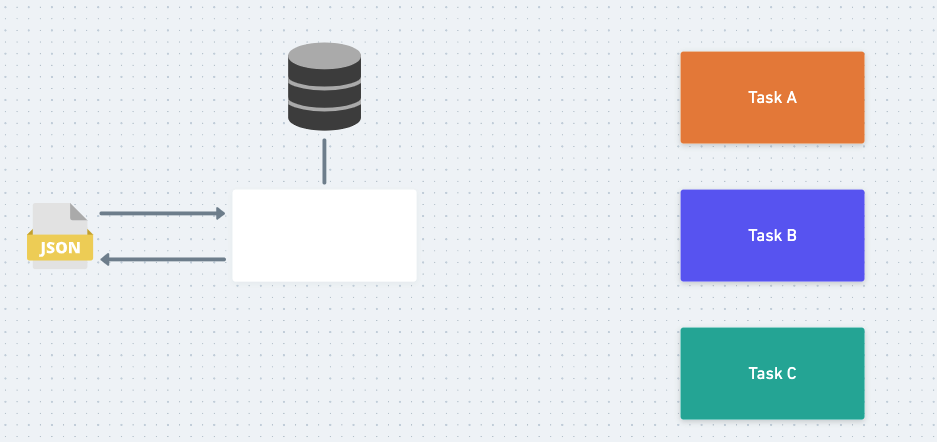

# Data Processing and Analyzing

Let's build a system that takes in a set of well-formed data, runs different tasks and/or processes on that data, and then outputs another set of well-formed data.

## Background and Context

- There are 3 tasks that need to be run in a workflow. What these tasks do isn't a requirement for the problem so we'll
refer to them generically as "task A", "task B", and "task C".
